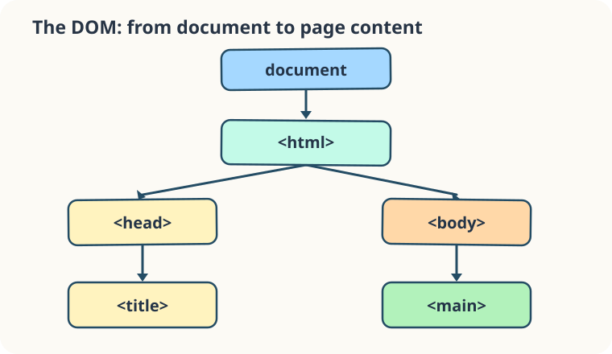

A browser does not hand JavaScript a flat string of HTML. It builds a **Document Object Model (DOM)**: a tree of nodes. In this community noticeboard, `<html>` contains `<head>` and `<body>`; `<main>` sits inside `<body>`. The `document` object is our entry point to that tree.



Open `index.html` and follow its indentation. `document.documentElement` is the `<html>` element; `document.body` is the `<body>` element. In `script.js`, `document.title` reads the text of the `<title>` in the head. The second line stores that title on the body as a `data-page-title` attribute. CSS notices that attribute and reveals the little ready badge. This makes an otherwise invisible document reference visible without searching for an element yet.

```javascript
const pageTitle = document.title;
document.body.dataset.pageTitle = pageTitle;
```

Run the preview: the badge changes from **waiting** to **Page connected**. The `<title>` in `index.html` is **Harbor notices**. Try changing only that title and run again; the body's `data-page-title` follows it, and the ready badge still appears. The DOM tree stays the same shape even when its text changes. Next, you will read a different document property yourself.
