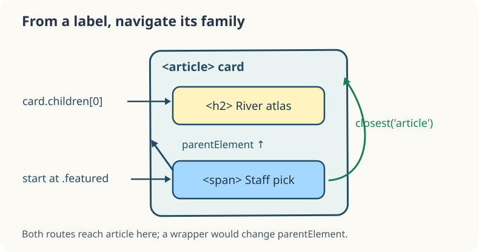

Selectors find a starting place. After that, the tree provides routes to nearby elements. On these book cards, the `.featured` label sits *inside* an article. `parentElement` moves one element up; `children` lists the parent's direct **element** children (not text nodes); `closest("article")` searches upward from the starting element, including itself, until it finds a matching ancestor.



```javascript
const label = document.querySelector(".featured");
const card = label.parentElement;
const firstChild = card.children[0];
const article = label.closest("article");
firstChild.textContent += " ★";
article.dataset.picked = "yes";
```

Run: the first card's heading gains a star and its border becomes green. Compare `parentElement` and `closest("article")` here: they happen to reach the same article because the label is a direct child. If a wrapper were inserted between them, `parentElement` would stop at that wrapper while `closest` would continue upward. `children[0]` is the first *element child* of the card, the heading. In the exercise you will navigate a deeper card, where the difference matters.
