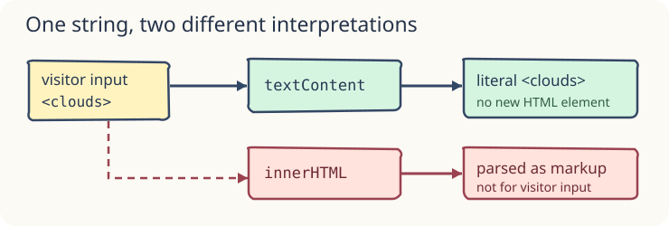

# Safe text and HTML

A community board prints a submitted note. The note is data, not markup: the browser must show its angle brackets literally.

## What the code does

`textContent` replaces a node’s text, escaping any tags in the assigned string. `innerHTML` parses the assigned string as HTML and can create elements, including unsafe markup when the string comes from a user. Reserve `innerHTML` for carefully controlled, trusted markup; do not use it for visitor input. Reading `.textContent` returns the visible text characters rather than an HTML source string.

In `script.js`, this is the important part of the already-working preview:

```javascript
const boardNote = document.querySelector("#board-note");
const visitorNote = "I brought <seedlings> today"; // Pretend this came from a form.
boardNote.textContent = visitorNote;
```



## Try it in the preview

The preview shows the literal `<seedlings>` characters; there is no new `seedlings` element. Change the string to `"<strong>hello</strong>"` and Run again: you should see the tags printed, not bold text. Restore the original string afterward.

When a string comes from a person or remote data, which property keeps it as text? `textContent`. Why not `innerHTML` here? It would parse the string as markup.

The next lesson gives you a different page to build from a starter.
