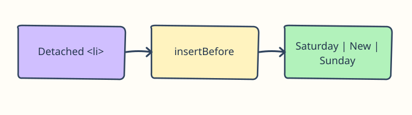

# Place Nodes Before and Between

A trail notice board needs its most urgent update first and a reminder between two older entries. Appending everything at the end would hide that order.

## How it works

`prepend(node)` puts a node at the start of a parent. For a specific slot, `parent.insertBefore(newNode, existingChild)` puts the new node directly before that child. The second argument must be a child of that same parent; `null` instead would mean append. Both methods move an existing node if it is already attached elsewhere—neither creates a copy. The diagram shows the insertion point.

```javascript
const urgent = document.createElement("li");
urgent.textContent = "Bridge inspection today";
board.prepend(urgent);
const reminder = document.createElement("li");
reminder.textContent = "Bring water";
board.insertBefore(reminder, document.querySelector("#sunday"));
```



## Try the preview

Run the preview and read top to bottom: Bridge inspection today, Saturday walk, Bring water, Sunday walk. Try placing the reminder before `#saturday` to see how the reference child controls the slot, then restore it.

## Remember

Last time you appended a node to the end of a parent. These methods use the same created node but let the intended reading order decide its position.

The following exercise uses the same idea in a different setting.
