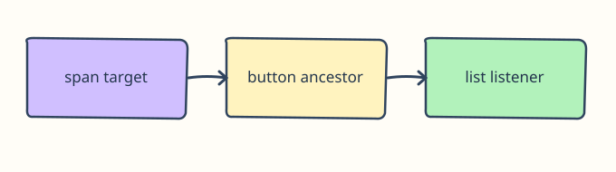

# Event Target, Current Target, and Delegation

Now that clicks make sense, a message board needs a Remove button for each message—including messages added later. A listener on each existing button would miss new buttons.

## How it works

On a bubbling `click`, `event.target` is the deepest clicked element; `event.currentTarget` is the element whose listener is running. Here the listener lives on `#messages`, so it can handle current and future descendants. `event.target.closest("button[data-remove]")` also works when a nested `<span>` receives the click. Check `list.contains(button)` to keep the action inside this list. A native button retains keyboard activation. A click on the list text alone does nothing.

```javascript
list.addEventListener("click", function (event) {
  const button = event.target.closest("button[data-remove]");
  if (!button || !event.currentTarget.contains(button)) return;
  button.closest("li").remove();
});
```



## Try the preview

Run the preview: Remove from the first row works, and Add message creates a new row whose Remove button also works. Click ordinary list text and observe that nothing is removed. Try clicking the nested Remove label: `closest` still finds its button.

## Remember

The previous pair registered one listener directly on one button. Delegation registers one listener on a stable parent and uses the event’s target to decide which child action occurred.

The following exercise uses the same idea in a different setting.
