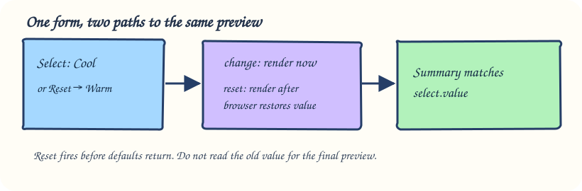

# Keep a selection in sync on change and reset

A market stall preference card shows the selected pickup window and returns to its default after Reset.

## Read the running example

Your earlier event handlers responded after one action. This form has two routes to the same display—choosing a new option and restoring defaults—so both must update the summary.

`change` fires when a committed selection changes, unlike the per-keystroke `input` event. A `reset` event arrives before the browser restores form values. Schedule the UI update in a microtask with `queueMicrotask` so the preview reads the restored default, or explicitly use the control’s `defaultValue` inside the reset handler.

Open `index.html` to locate the labelled control and output. In `script.js`, notice the selectors point to those IDs, then follow the event from the control to the updated page. `style.css` only changes presentation; it does not cause the behavior. This example is finished already so you can run it before writing the next exercise.

## Try it in the preview

Choose Evening and watch the summary. Press Reset: both select and summary should say Morning. Trace the two paths into one `render` function so they cannot disagree.

Nothing in this demo is graded. The following exercise asks you to build the same *idea* for a different situation; come back here if the event or state change feels hard to trace.

