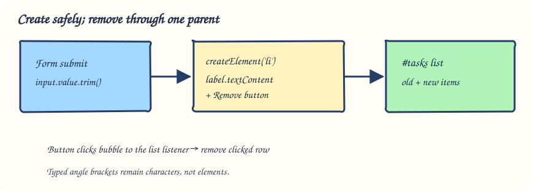

# Create and remove items with one delegated listener

A repair café tracks tools to bring. Visitors can add tools and remove either an original or newly added entry.

## Read the running example

This combines the earlier node-creation chapter with submit handling, accessible feedback, and event delegation. The parent list exists before any additions, so it is a dependable place for the click listener even when new buttons arrive later.

A form `submit` handler creates a new `<li>` with `document.createElement`. Put user-supplied text in `textContent`, never an HTML template, so characters such as `<` stay literal. One `click` listener on the stable parent list can handle Remove buttons on both original and future items: use `event.target.closest("button")`, confirm it belongs to this list, then remove its nearest list item.

Open `index.html` to locate the labelled control and output. In `script.js`, notice the selectors point to those IDs, then follow the event from the control to the updated page. `style.css` only changes presentation; it does not cause the behavior. This example is finished already so you can run it before writing the next exercise.

## Try it in the preview

Add “Soldering iron”, remove it, and remove a starter entry. Type `` and check that those characters display literally instead of turning into an image. Trace why the listener belongs to the list instead of each new button.

Nothing in this demo is graded. The following exercise asks you to build the same *idea* for a different situation; come back here if the event or state change feels hard to trace.

