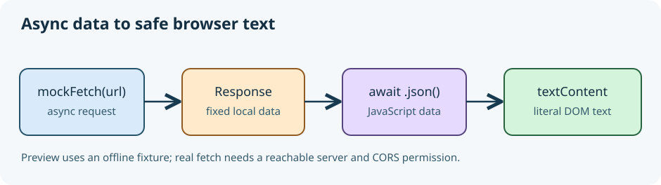

# Fetch JSON and render safe text

A noticeboard needs one featured item from a data service. The preview is intentionally powered by an **explicit in-page mock fetch**, so it works offline and never claims to show live data.

`fetch(url)` returns a **Promise** for a `Response`; it does not return JSON immediately. `await` pauses the async function until the response arrives, and `await response.json()` parses the body into JavaScript data. Here `mockFetch` returns a real `Response` built from a fixed in-page fixture, so the preview is repeatable offline. It is **not live network data**. Read the `mockFetch` definition before the call site: replacing only the fetch-shaped function is what makes this demo portable.

The display uses `textContent`, never `innerHTML`, for a title from data. Even if a server returned ``, the browser would print those characters instead of creating an element. Keep fixed markup in HTML, and fill its text from data. An async function returns a Promise too; the click handler starts it without freezing the page.

```javascript
async function showNotice() {
  const response = await mockFetch("/api/notice"); // offline fixture here
  const notice = await response.json();
  document.querySelector("#notice").textContent = notice.title;
}
```

Run the preview and click **Load notice**. You should see the literal angle brackets in the title, not a new image. Try changing the fixed title in `mockFetch` and run again. The next lesson lets you build the same flow for a different kind of data.

On a real site, the browser's built-in `fetch()` makes the network request instead of the local mock:

```javascript
// Illustrative real-network pattern; this example URL is not a working API.
const response = await fetch("https://api.example.com/notices");
if (!response.ok) throw new Error(`HTTP ${response.status}`);
const notice = await response.json();
document.querySelector("#notice").textContent = notice.title;
```

The server must allow your page's origin via CORS; a `srcdoc` sandbox or offline browser may block external requests. Unlike the in-page fixture, real calls can also reject or return no results. We handle those states in the next pair.



## Learn more

MDN's [Using the Fetch API](https://developer.mozilla.org/en-US/docs/Web/API/Fetch_API/Using_Fetch) explains the network version and response parsing.
