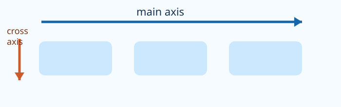

# Flex Direction Demo

## Mission

Flex direction decides whether a trail-kit list grows across or down.

## What to notice

A flex container has a main axis; `flex-direction` changes it.. Read the completed `index.html` and `style.css` together, then match each rule to the visible change.

## Try the preview

Change one value in `style.css`, run the preview, and name what changed. Try a different `gap`, alignment value, or track size where it is relevant. Restore the original value before moving on.

## Checkpoint

The completed preview is your reference. The next lesson asks you to build one focused part of it from a starter.

## Learn more

MDN’s official guide explains flex axes, alignment, wrapping, and the other layout controls you will use next. Read [MDN’s reference for CSS flexible box layout](https://developer.mozilla.org/en-US/docs/Web/CSS/Guides/Flexible_box_layout) when you want to go further.
