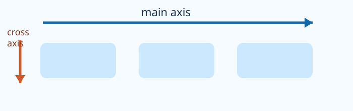

# Trail kit: completed layout

The demo places three trail-kit cards in a horizontal row. Compare that row with a column before building the vertical version in the next exercise. This completed preview shows the layout before you edit the next exercise.

In `style.css`, `.kit-row` controls the section. `display: flex` turns the kit section into a flex container. The main axis follows `flex-direction: row` from left to right; column would stack the items from top to bottom.

**Checkpoint:** inspect the card positions in Preview and locate `flex-direction: row` in the stylesheet.

Change `flex-direction` temporarily to `column`, run Preview, and compare the positions. Restore `row` before moving to the exercise.
## Learn more

See [MDN’s guide to CSS flexible box layout](https://developer.mozilla.org/en-US/docs/Web/CSS/Guides/Flexible_box_layout) for more examples.
