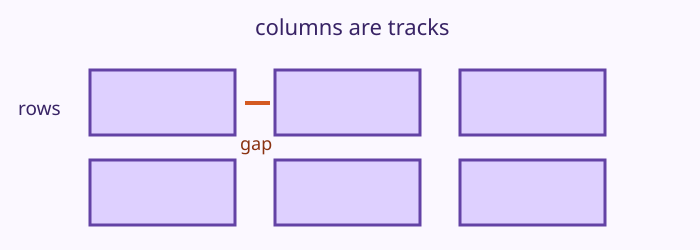

# Grid Tracks Demo

## Mission

A volunteer board needs tidy columns for three workshop cards.

## What to notice

Grid creates explicit rows and columns, called tracks.. Read the completed `index.html` and `style.css` together, then match each rule to the visible change.

## Try the preview

Change one value in `style.css`, run the preview, and name what changed. Try a different `gap`, alignment value, or track size where it is relevant. Restore the original value before moving on.

## Checkpoint

The completed preview is your reference. The next lesson asks you to build one focused part of it from a starter.

## Learn more

MDN’s official guide has more examples of grid tracks, placement, named areas, and responsive grids. Read [MDN’s reference for CSS grid layout](https://developer.mozilla.org/en-US/docs/Web/CSS/Guides/Grid_layout) when you want to go further.
