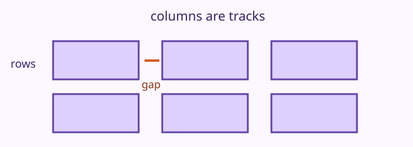

# Grid Tracks Demo

## Mission

A volunteer board needs tidy columns for three workshop cards.

## What to notice

`display: grid` creates a grid container. `repeat(3, 1fr)` gives it three equal column tracks. Find the selector, property, and value in `style.css` and compare the preview.

## Try the preview

Change three columns to two and watch the last card wrap, then restore three.

## Checkpoint

The completed preview is your reference. The next lesson asks you to build one focused part of it from a starter.

## Learn more

MDN’s official guide has more examples of grid tracks, placement, named areas, and responsive grids. Read [MDN’s reference for CSS grid layout](https://developer.mozilla.org/en-US/docs/Web/CSS/Guides/Grid_layout) when you want to go further.
