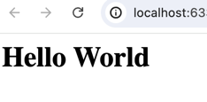

# What is HTML?

The world wide web is full of information written in different languages. Those information are written using different languages. One of the most popular language used to write information on the web is HTML. 

> HTML stands for HyperText Markup Language. 

HTML files are simple text files that are written with specific syntax to represent information to the web browsers. If you want to create one of the web pages yourself, all you need is a text editor and a web browser. 

You can use text editors like VS Code, Atom or Sublime text which offer syntax highlighting for HTML. Please note that Microsoft Word is not really a text editor because it applies formatting to the text which is not suitable for writing code. The most common text editor is Notepad in Windows and TextEdit in Mac. These text editors are simple and do not apply any specific styling to the files you create.

HTML is *not* a programming language. It is a *markup language*. It is used to structure content on the web. HTML is the standard markup language for documents designed to be displayed in a web browser. Web pages can be augmented by technologies such as Cascading Style Sheets (CSS) and scripting languages such as JavaScript.

## How browsers read HTML

When you open an HTML file in a browser, the browser reads the file from top to bottom, interprets the HTML tags, and renders the content on screen. The browser takes care of layout, default fonts, and spacing — you just provide the structure. You might wonder, wait what's the tag? Just hold on, you'll get to know the glory details of tags in the next lesson. 

## Your first HTML file

Let's write some HTML code now. The simplest possible HTML file is a plain text file with the `.html` extension. For this lesson, let's create a file called `index.html`. Open your text editor and write the following:

```html
Hello World
```

Save this as `index.html` and open it in a browser. You will see the text `Hello World` displayed. The browser happily shows it even though yout simply wrote plain English.

Now change the file to below:

```html
<h1>Hello World</h1>
```

Refresh the browser window. The text is now displayed as a large, bold heading. Just for teaser, the `<h1>` is called an HTML **tag** — more on that in the next lesson.



## Key Takeaways

- HTML is simply a markup language used to structure the content on the web. 
- HTML files are plain text files with the `.html` extension.

