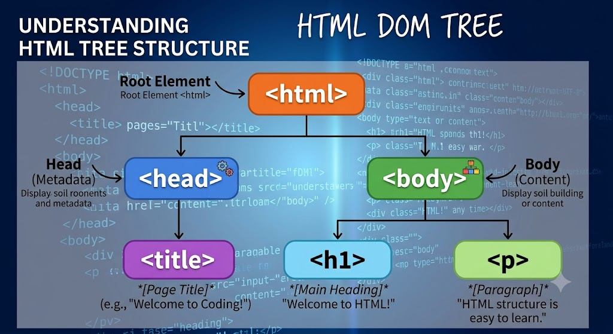

# Elements, Tags, and Attributes

Although HTML is plain text, it needs structure so that browsers understand it. That structure is provided by three things: **tags**, **elements**, and **attributes**.

## Tags

HTML tags are keywords surrounded by angle brackets, like `<html>`. Most tags come in pairs — an opening tag and a closing tag.

```html
<html> ... </html>
```

The closing tag has a forward slash before the tag name. Some tags are **self-closing** — they have no content and no closing tag.

```html
<br>

```

## A proper HTML5 document

Here is a complete, standards-compliant HTML5 page. HTML pages are structured with a root `<html>` element which contains a `<head>` and a `<body>`. The `<head>` contains information about the page, while the `<body>` contains the content that is displayed in the browser.

```html
<!DOCTYPE html>
<html>
    <head>
    </head>
    <body>
        <h1>Hello World</h1>
    </body>
</html>
```

You can think of HTML as a tree structure as shown below.



Let's understand what each of these tags mean.

The first line `<!DOCTYPE html>` tells the browser that this is an HTML5 document. This is called a **document type declaration** and let's the browser know which version of HTML this document is using. There were previous versions of HTML, but HTML5 is the current standard.

Next, the `<html>` tag is the root element of the page. Everything between the opening `<html>` and closing `</html>` tags is part of the HTML document. The `<head>` element contains information about the page, such as its title and metadata. The `<body>` element contains the content that is displayed in the browser window. You can notice that the `body` tag is nested inside the `html` tag. This way you can create a hierarchy of elements.

| Tag | Purpose |
|-----|---------|
| `<!DOCTYPE html>` | Tells the browser this is an HTML5 document |
| `<html>` | Root element — wraps everything |
| `<head>` | Contains information about the page |
| `<body>` | The content visible in the browser window |
| `<h1>` | A top-level heading |

You can also notice that the nested tags are indented. This indentation is not required for browsers to read the HTML correctly, but it makes the code easier for humans to read. You should always indent nested tags to make your code more readable.

## Elements

An **element** is the combination of an opening tag, its content, and its closing tag. They look like this.

```html
<tagname>content</tagname>
```

Again as mentioned above, elements can be nested — one element can contain other HTML elements. For example, in below code snippet, the `<body>` element contains an `<h1>` element. You can say that the `h1` element is a child of the `body` element and the `body` element is a parent of the `h1` element. You can also say that the `h1` element is nested inside the `body` element.

```html
<body>
    <h1>Hello World</h1>
</body>
```

Everything between `<body>` and `</body>` is part of the body element including the `h1` element and its content.

## Attributes

Attributes add extra information to a tag. They are always written inside the opening tag as `name="value"` pairs. You can add multiple attributes to a tag by separating them with spaces. Below is an example of an anchor tag with an `href` attribute. You will learn more about anchor tags in the upcoming lessons.

```html
<a href="https://www.example.com">Visit My Website</a>
```

The `href` attribute tells the browser where the link goes. There are some common attributes which can be applied to any element. These are called global attributes. They include attributes like `id`, `class`, and `style`. 

```html
<h1 id="main-heading">Hello World</h1>
<p id="intro">This is a paragraph.</p>
```

Other attributes are element-specific, like `src` on ``. For example, the `` tag has two attributes: `src` and `alt`. These attributes are separated by a space and are written inside the opening tag. You will learn more about what these attributes mean in the upcoming lessons. So, don't worry if you don't understand them yet.

```html

```

> You do not need to memorise every attribute. Your editor's auto-complete and the documentation will guide you when you need them.

## Exercise

The starter file has a bare `<body>`. Your tasks:

1. Add an `<h1>` with the text **"My First Page"** and give it an `id` of `"title"`.
2. Add a `<p>` tag below it with any text you like. The text should be at least two sentences long.
3. Add a self-closing `<br>` tag between two sentences **inside** the paragraph `p` element. It should be like `<p>First<br>Second</p>`.
