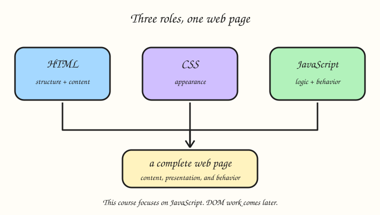
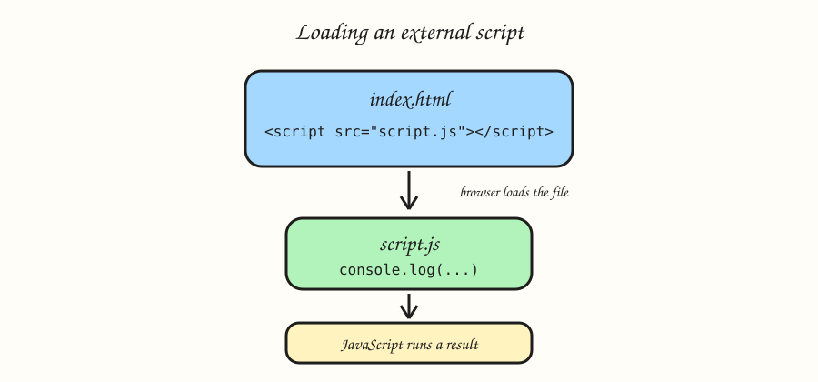

# What is JavaScript?

## Mission: Signal Launch

You are the programmer for the Starline Awards, a live showcase for a rising superstar. This stage helps you turn the Starline Awards scoreboard from a static page into a program that can report its own score. This one integration lesson uses `index.html` and `script.js` together; later stages focus on JavaScript programming in `script.js`, not changing page elements.

Run the code and use the Console as your checkpoint. Read the example, make one focused change, then complete the task.

JavaScript runs in the browser and powers the interactive parts of the web. This first coding lesson keeps the idea simple: store a message, calculate a number, and show both on the page.

## HTML, CSS, and JavaScript have different jobs



- **HTML** gives the page its structure and content.
- **CSS** controls the visual presentation.
- **JavaScript** calculates, decides, and responds to input. This first lesson writes a result into the page only so you can see how the two files connect.

## Include JavaScript from HTML



`index.html` contains the page shell and add this line near the end of `<body>`:

```html
<script src="script.js"></script>
```

That `src` value is the filename. The browser reads `index.html`, reaches the script tag, and then runs `script.js`. Both tabs are visible in this one lesson because the connection is the topic. From the next lesson onward, the missions use `script.js` and the Console only.

## Example

```javascript
const notice = "Exhibit open";
const visitors = 4 * 6 - 1;
console.log(`${notice}: ${visitors}`);
```

## Your Task

1. Create introMessage with the text "JavaScript rocks!" and introNumber with the result of (5 * 3) + 2.
2. Display `JavaScript rocks! | 17` in `#output` after the script runs.
