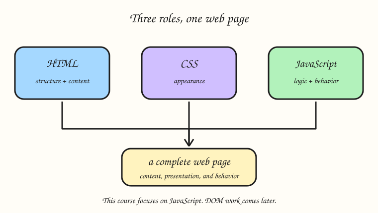
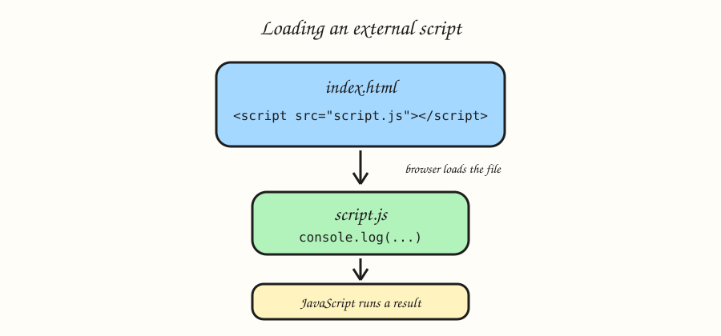

# What is JavaScript?

## Mission: Signal Launch

The Starline Awards scoreboard starts as a static page. In this one bridge lesson, connect `index.html` to `script.js` and show a calculated result in the page. The remaining lessons in these sections use only `script.js` and the Console.

Run the starter and watch the paragraph in the preview. It is empty until your script writes the message and number into `#output`.

JavaScript runs in the browser and powers the interactive parts of the web. This first coding lesson keeps the idea simple: store a message, calculate a number, and show both on the page.

## HTML, CSS, and JavaScript have different jobs



- **HTML** gives the page its structure and content.
- **CSS** controls the visual presentation.
- **JavaScript** calculates, decides, and responds to input. This first lesson writes a result into the page only so you can see how the two files connect.

## Include JavaScript from HTML



`index.html` contains the page shell and includes this line near the end of `<body>`:

```html
<script src="script.js"></script>
```

That `src` value is the filename. The browser reads `index.html`, reaches the script tag, and then runs `script.js`. Both tabs are visible in this one lesson because the connection is the topic. From the next lesson onward, the missions use `script.js` and the Console only.

## Example

`const` gives a value a name. In the last line, `${...}` inserts a value into the backtick-delimited message. The Console displays the result; the starter's `document.getElementById("output").textContent` displays it on the page instead. You will study these tools in more detail later.

```javascript
const notice = "Exhibit open";
const visitors = 4 * 6 - 1;
console.log(`${notice}: ${visitors}`);
```

## Your Tasks

1. Set `introMessage` to `"JavaScript rocks!"`; the provided probe will log `message: JavaScript rocks!`.
2. Calculate `introNumber` as `(5 * 3) + 2`; the provided probe will log `number: 17`.
3. Show `JavaScript rocks! | 17` in `#output` using both values.
